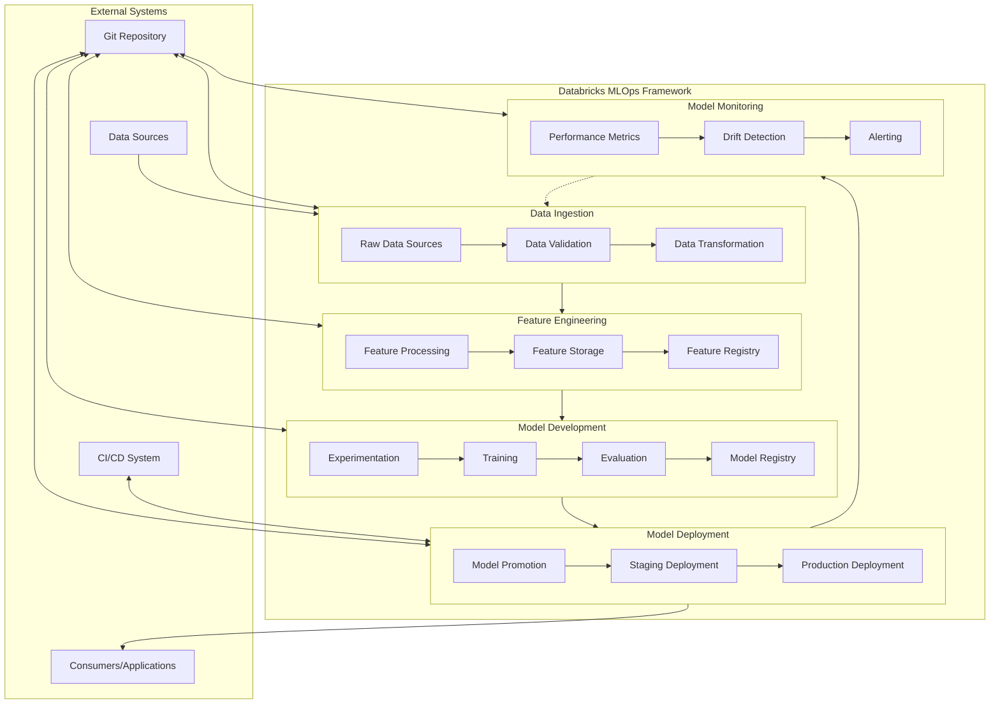
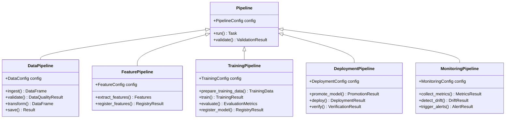
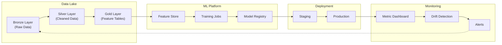
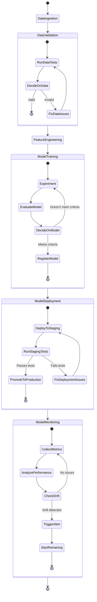

<div align="center">

```
       ████████╗██╗   ██╗██████╗ ███████╗███████╗ █████╗ ███████╗███████╗       
      ╚══██╔══╝╚██╗ ██╔╝██╔══██╗██╔════╝██╔════╝██╔══██╗██╔════╝██╔════╝       
         ██║    ╚████╔╝ ██████╔╝█████╗  ███████╗███████║█████╗  █████╗         
         ██║     ╚██╔╝  ██╔═══╝ ██╔══╝  ╚════██║██╔══██║██╔══╝  ██╔══╝         
         ██║      ██║   ██║     ███████╗███████║██║  ██║██║     ███████╗       
         ╚═╝      ╚═╝   ╚═╝     ╚══════╝╚══════╝╚═╝  ╚═╝╚═╝     ╚══════╝       
                                                                               
██████╗  █████╗ ████████╗ █████╗ ██████╗ ██████╗ ██╗ ██████╗██╗  ██╗███████╗   
██╔══██╗██╔══██╗╚══██╔══╝██╔══██╗██╔══██╗██╔══██╗██║██╔════╝██║ ██╔╝██╔════╝   
██║  ██║███████║   ██║   ███████║██████╔╝██████╔╝██║██║     █████╔╝ ███████╗   
██║  ██║██╔══██║   ██║   ██╔══██║██╔══██╗██╔══██╗██║██║     ██╔═██╗ ╚════██║   
██████╔╝██║  ██║   ██║   ██║  ██║██████╔╝██║  ██║██║╚██████╗██║  ██╗███████║   
╚═════╝ ╚═╝  ╚═╝   ╚═╝   ╚═╝  ╚═╝╚═════╝ ╚═╝  ╚═╝╚═╝ ╚═════╝╚═╝  ╚═╝╚══════╝   
                                                                               
    ███╗   ███╗██╗      ██████╗ ██████╗ ███████╗                               
    ████╗ ████║██║     ██╔═══██╗██╔══██╗██╔════╝                               
    ██╔████╔██║██║     ██║   ██║██████╔╝███████╗                               
    ██║╚██╔╝██║██║     ██║   ██║██╔═══╝ ╚════██║                               
    ██║ ╚═╝ ██║███████╗╚██████╔╝██║     ███████║                               
    ╚═╝     ╚═╝╚══════╝ ╚═════╝ ╚═╝     ╚══════╝                               
```

# Databricks MLOps Framework

### A strongly-typed, Pydantic-based MLOps framework for production ML on Databricks

[](https://github.com/gonnect-uk/databricks-mlops/blob/main/LICENSE)
[](https://github.com/gonnect-uk/databricks-mlops/stargazers)
[](https://pypi.org/project/databricks-mlops/)
[]()
[]()
[]()

</div>

## Overview

A comprehensive, type-safe MLOps framework for Databricks that follows best practices for the end-to-end machine learning lifecycle. The framework emphasizes type safety, modularity, and automated MLOps processes.

## 📚 Documentation

| Document | Description |
|----------|-------------|
| [**API Reference**](API_REFERENCE.md) | Comprehensive API reference for all framework components |
| [**Usage Guide**](USAGE_GUIDE.md) | Step-by-step guide to using the framework with examples |
| [**Architecture Overview**](ARCHITECTURE.md) | Detailed architecture and design principles |

## 🔍 Key Features

- **Strong Type Safety**: Built from the ground up with Pydantic models and Python type annotations
- **Modular Pipeline Components**: Standardized interfaces for data, feature, training, deployment, and monitoring pipelines
- **Configuration-Driven**: All behavior controlled through strongly-typed YAML configurations
- **Databricks Integration**: Seamless integration with Databricks Delta tables, MLflow, and model serving
- **Monitoring & Drift Detection**: Built-in components for model monitoring and drift detection
- **Validation**: Data validation at every step of the ML pipeline
- **Type-Safe Expression Language**: Pandas-style validation expressions with full type safety
- **Model Serving**: Strongly-typed clients for Databricks model serving endpoints

## MLOps Workflow Overview

This framework provides end-to-end MLOps capabilities with type safety at every step, following a standardized workflow:

1. **Data Ingestion & Validation** - Load data with validations using the expression language
2. **Feature Engineering** - Create and transform features with proper typing
3. **Model Training** - Train models with MLflow integration and type safety
4. **Model Deployment** - Deploy models to Databricks model registry
5. **Model Serving** - Access deployed models through type-safe serving clients
6. **Model Monitoring** - Track drift and performance with typed metrics

## 🌐 Model Serving for Classical ML

The framework provides strongly-typed clients for interacting with Databricks model serving endpoints, ensuring type safety throughout the request-response cycle. The focus is on classical machine learning tasks like classification and regression.

### Example: Model Serving for Tabular Data

```python
from databricks_mlops.utils.model_serving import (
    TabularModelClient, EndpointCredentials, AuthType
)
import pandas as pd

# Create strongly-typed credentials
credentials = EndpointCredentials(
    auth_type=AuthType.TOKEN,
    token="your-databricks-token"
)

# Initialize the client with proper typing
client = TabularModelClient(
    workspace_url="https://your-workspace.cloud.databricks.com",
    credentials=credentials
)

# Prepare feature data with correct types
feature_data = pd.DataFrame({
    "tenure": [12, 24, 36],
    "monthly_charges": [50.0, 70.0, 90.0],
    "contract_type": ["Month-to-month", "One year", "Two year"],
    "total_charges": [600.0, 1680.0, 3240.0]
})

# Get predictions with full type safety
predictions = client.predict(
    endpoint_name="customer-churn-classifier",
    features=feature_data
)

# Process results with proper DataFrame typing
churn_probabilities = predictions['probability']
print(f"Predicted churn probability: {churn_probabilities}")
```

### Key Benefits

- **Type Safety**: All interactions with endpoints maintain proper data types
- **Credential Management**: Secure handling of authentication tokens
- **Error Handling**: Detailed error messages with proper typing
- **Retry Logic**: Smart retries for transient failures
- **Production Integration**: Seamless connection to production ML endpoints

For more advanced usage, including batch predictions and custom model types, see the [API Reference](API_REFERENCE.md#model-serving).

## 📲 Installation

We recommend using [uv](https://github.com/astral-sh/uv) for faster, more reliable Python package management:

```bash
# From PyPI
uv pip install databricks-mlops

# From GitHub
uv pip install git+https://github.com/gonnect-uk/databricks-mlops.git

# Development installation
git clone https://github.com/gonnect-uk/databricks-mlops.git
cd databricks-mlops
uv pip install -e .

# Install with all dependencies
uv pip install "databricks-mlops[all]"

# Install specific components
uv pip install "databricks-mlops[data,feature-engineering,model-training]"  # ML components
uv pip install "databricks-mlops[deployment,monitoring]"  # Production components
```

You can also use traditional pip if uv is not available:

```bash
pip install databricks-mlops
```

## 💾 Examples

The `examples/` directory contains practical implementations showcasing the framework:

| Example | Description |
|---------|-------------|
| [**Complete MLOps Pipeline**](examples/complete_mlops_pipeline.py) | End-to-end MLOps pipeline orchestration |
| [**Customer Churn Prediction**](examples/customer_churn_prediction.py) | Practical implementation of churn prediction model |
| [**Model Monitoring**](examples/model_monitoring_example.py) | Drift detection and monitoring implementation |
| [**Model Serving**](examples/model_serving_example.py) | Type-safe Databricks model serving endpoint integration |
| [**Integrated Serving**](examples/integrated_serving_example.py) | Complete workflow from training to serving with type safety |
| [**Expression Validation**](examples/expression_validation_example.py) | Type-safe validation expressions with Pandas-style syntax |
| [**Integration Tests**](examples/integration_test.py) | Tests demonstrating component interactions |

## 🔐 Type Safety Philosophy

This framework is built on a foundation of aggressive type safety and pure Pydantic models:

- **No Direct JSON Handling**: All data structures are proper Pydantic models
- **No String Manipulation**: Proper type casting and validation instead of string parsing
- **No `hasattr()` Checks**: Explicit model attributes with proper defaults
- **Domain-Driven Design**: Components map directly to MLOps domain concepts
- **Specialized Exceptions**: Clear error types instead of generic exceptions
- **Functional Approach**: Helper methods and immutable data where possible
- **Robust Fallbacks**: Proper default values and clear error handling

Every component in the framework follows this philosophy, ensuring maximum type safety with minimal runtime errors.

## 📊 Data Validation Expression Language

The framework provides a strongly-typed validation system that supports Pandas-style expressions while maintaining type safety. Validation rules use a familiar syntax derived from Pandas expressions but are wrapped in our type-safe validation models.

### Expression Syntax

Validation conditions support the following operations:

| Category | Operations | Example |
|----------|------------|--------|
| **Comparison** | `==`, `!=`, `>`, `>=`, `<`, `<=`, `is null`, `is not null` | `age >= 18` |
| **String** | `.str.contains()`, `.str.startswith()`, `.str.endswith()`, `.str.match()` | `email.str.contains('@')` |
| **Logical** | `and`, `or`, `not` | `(age >= 18) and (country == 'US')` |
| **Mathematical** | `+`, `-`, `*`, `/`, `%` | `total_amount == quantity * price` |
| **Collection** | `in`, `not in` | `status in ['active', 'pending']` |

### Examples with Type Information

| Validation Rule | Purpose | Type-Safety Aspect |
|-----------------|---------|-------------------|
| `customer_id is not null` | Ensure required field exists | Auto-casts to proper nullable field |
| `email.str.contains('@') or email is null` | Allow valid emails or nulls | String-specific methods only apply to string fields |
| `tenure >= 0` | Enforce non-negative values | Numeric constraint on numeric field |
| `total_charges >= monthly_charges` | Business rule validation | Numeric comparison with field context |
| `date_of_birth < current_date()` | Temporal validation | Auto-converts string dates to datetime |
| `status in ['active', 'pending', 'closed']` | Enumeration validation | Validates against allowed values |

### YAML Configuration Example

```yaml
validation_rules:
  - name: "valid_email"
    condition: "email.str.contains('@') or email is null"
    severity: "warning"
    description: "Email should be valid format or null"
    
  - name: "adult_age"
    condition: "age >= 18 or guardian_email is not null"
    severity: "error"
    description: "Users under 18 need a guardian email"
    
  - name: "pricing_consistency"
    condition: "total_price == (quantity * unit_price) * (1 - discount_rate)"
    severity: "error"
    description: "Total price must match calculation"
```

Unlike traditional string-based validation, these expressions are parsed and type-checked at runtime, ensuring that string operations are only applied to string fields, numeric operations to numeric fields, etc. This provides the flexibility of expression-based validation with the safety of strong typing.

## 📋 YAML Configuration Reference

The framework uses strongly-typed YAML configuration files for all components, ensuring type safety while maintaining readability. Each configuration is automatically validated against Pydantic models at runtime.

### Data Pipeline Configuration

| Field | Type | Description | Default | Required |
|-------|------|-------------|---------|----------|
| `source_path` | `str` | Path to source data (Delta table or file) | - | ✅ |
| `destination_path` | `str` | Path where processed data will be saved | - | ✅ |
| `validation_rules` | `List[ValidationRule]` | Data quality validation rules | `[]` | ❌ |
| `format` | `str` | Data format (delta, parquet, csv) | `"delta"` | ❌ |
| `transformation_steps` | `List[TransformStep]` | Data transformation operations | `[]` | ❌ |
| `partitioning_columns` | `List[str]` | Columns to partition by | `[]` | ❌ |
| `z_order_by` | `List[str]` | Columns to optimize using Z-ordering | `[]` | ❌ |
| `environment_vars` | `Dict[str, str]` | Environment variables for substitution | `{}` | ❌ |

**Example:**

```yaml
source_path: "dbfs:/mnt/data/raw/customer_data"
destination_path: "dbfs:/mnt/data/processed/customer_data"
format: "delta"
partitioning_columns: ["region", "date"]
validation_rules:
  - name: "no_missing_ids"
    condition: "customer_id is not null"
    severity: "error"
    description: "Customer ID should never be null"
  - name: "valid_email"
    condition: "email.str.contains('@') or email is null"
    severity: "warning"
    description: "Email should have valid format if present"
transformation_steps:
  - type: "drop_columns"
    columns: ["temp_id", "_metadata"]
  - type: "rename_columns"
    mapping: {"customer_identifier": "customer_id"}
z_order_by: ["customer_id", "transaction_date"]
environment_vars:
  DATA_ENV: "${DATA_ENV:-production}"
  REGION: "${REGION:-us-west}"
```

### Feature Engineering Configuration

| Field | Type | Description | Default | Required |
|-------|------|-------------|---------|----------|
| `source_table` | `str` | Source table for feature creation | - | ✅ |
| `feature_table_name` | `str` | Name for the output feature table | - | ✅ |
| `primary_keys` | `List[str]` | Primary key column(s) | - | ✅ |
| `features` | `List[str]` | List of features to include | `[]` | ✅ |
| `timestamp_column` | `str` | Column for temporal tracking | - | ✅ |
| `partition_columns` | `List[str]` | Columns to partition feature table by | `[]` | ❌ |
| `description` | `str` | Feature table description | `""` | ❌ |
| `tags` | `Dict[str, str]` | Metadata tags | `{}` | ❌ |
| `online_store_enabled` | `bool` | Enable online feature store | `False` | ❌ |
| `offline_store_path` | `str` | Path for offline feature store | - | ❌ |
| `feature_transformations` | `Dict[str, TransformSpec]` | Feature-specific transformations | `{}` | ❌ |

**Example:**

```yaml
source_table: "main.analytics.customer_data_processed"
feature_table_name: "customer_churn_features"
primary_keys: 
  - "customer_id"
features:
  - "tenure"
  - "monthly_charges"
  - "total_charges"
  - "contract_type"
  - "payment_method"
timestamp_column: "last_update_time"
partition_columns:
  - "subscription_type"
description: "Feature table for customer churn prediction"
tags:
  owner: "data_science_team"
  version: "1.0.0"
online_store_enabled: true
offline_store_path: "dbfs:/mnt/gold/feature_store/customer_churn_features"
feature_transformations:
  contract_type:
    type: "one_hot_encode"
    output_columns: ["contract_monthly", "contract_yearly", "contract_quarterly"]
  monthly_charges:
    type: "scaling"
    method: "min_max"
```

### Model Training Configuration

| Field | Type | Description | Default | Required |
|-------|------|-------------|---------|----------|
| `model_type` | `str` | Type of model (classification, regression, etc.) | - | ✅ |
| `target_column` | `str` | Target variable for prediction | - | ✅ |
| `feature_columns` | `List[str]` | Features to use for training | - | ✅ |
| `hyperparameters` | `Dict[str, Any]` | Model hyperparameters | `{}` | ❌ |
| `split_ratios` | `List[float]` | Train/validation/test split ratios | `[0.7, 0.15, 0.15]` | ❌ |
| `metrics` | `List[str]` | Metrics to track during training | `[]` | ❌ |
| `experiment_name` | `str` | MLflow experiment name | - | ✅ |
| `run_name` | `str` | MLflow run name | `""` | ❌ |
| `registry_model_name` | `str` | Name for registering in MLflow Model Registry | - | ✅ |
| `cross_validation_folds` | `int` | Number of cross-validation folds | `0` | ❌ |
| `stratify` | `bool` | Whether to stratify the training split | `False` | ❌ |
| `sample_weight_column` | `str` | Column to use for weighted training | `""` | ❌ |

**Example:**

```yaml
model_type: "classification"
target_column: "churn"
feature_columns:
  - "tenure"
  - "monthly_charges"
  - "contract_monthly"
  - "contract_yearly"
  - "tech_support"
hyperparameters:
  n_estimators: 100
  max_depth: 5
  min_samples_split: 10
  class_weight: "balanced"
  random_state: 42
split_ratios: [0.7, 0.15, 0.15]
metrics:
  - "accuracy"
  - "precision"
  - "recall"
  - "f1_score"
  - "roc_auc"
experiment_name: "customer_churn_prediction"
run_name: "xgboost_tuned_v2"
registry_model_name: "customer_churn_predictor"
cross_validation_folds: 5
stratify: true
sample_weight_column: "importance_weight"
```

### Model Deployment Configuration

| Field | Type | Description | Default | Required |
|-------|------|-------------|---------|----------|
| `model_name` | `str` | Name of the registered model | - | ✅ |
| `model_version` | `str` | Version to deploy (or "latest") | - | ✅ |
| `environment` | `str` | Deployment environment (dev, staging, prod) | - | ✅ |
| `deployment_type` | `str` | Type of deployment (serving_endpoint, batch, etc.) | - | ✅ |
| `endpoint_name` | `str` | Name for serving endpoint | - | ❌ |
| `compute_type` | `str` | Compute type (cpu, gpu) | `"cpu"` | ❌ |
| `compute_scale` | `int` | Compute size/scale | `1` | ❌ |
| `min_replicas` | `int` | Minimum number of replicas | `1` | ❌ |
| `max_replicas` | `int` | Maximum number of replicas | `1` | ❌ |
| `autoscaling_enabled` | `bool` | Enable auto-scaling | `False` | ❌ |
| `enable_access_control` | `bool` | Enable endpoint access control | `True` | ❌ |
| `timeout_seconds` | `int` | Timeout for endpoint requests | `300` | ❌ |
| `tags` | `Dict[str, str]` | Metadata tags | `{}` | ❌ |
| `environment_variables` | `Dict[str, str]` | Environment variables for endpoint | `{}` | ❌ |

**Example:**

```yaml
model_name: "customer_churn_predictor"
model_version: "1"
environment: "staging"
deployment_type: "serving_endpoint"
endpoint_name: "customer-churn-predictor"
compute_type: "cpu"
compute_scale: 2
min_replicas: 1
max_replicas: 5
autoscaling_enabled: true
enable_access_control: true
timeout_seconds: 300
tags:
  purpose: "churn_prediction"
  team: "customer_analytics"
  version: "1.0.0"
environment_variables:
  LOG_LEVEL: "INFO"
  ENABLE_MONITORING: "true"
  RATE_LIMITING: "100"
```

### Monitoring Configuration

| Field | Type | Description | Default | Required |
|-------|------|-------------|---------|----------|
| `enabled` | `bool` | Enable monitoring | `True` | ❌ |
| `metrics` | `List[str]` | Metrics to monitor | - | ✅ |
| `alert_thresholds` | `Dict[str, float]` | Alerting thresholds for metrics | `{}` | ❌ |
| `monitoring_interval_minutes` | `int` | Monitoring frequency in minutes | `60` | ❌ |
| `data_drift_detection` | `DataDriftConfig` | Data drift detection settings | - | ❌ |
| `model_performance_tracking` | `ModelPerfConfig` | Performance tracking settings | - | ❌ |
| `alerting` | `AlertConfig` | Alerting configuration | - | ❌ |
| `dashboard_name` | `str` | Monitoring dashboard name | `""` | ❌ |

**Example:**

```yaml
enabled: true
metrics:
  - "prediction_drift"
  - "feature_drift"
  - "model_accuracy"
  - "data_quality"
alert_thresholds:
  prediction_drift: 0.1
  feature_drift: 0.05
  model_accuracy: 0.8
monitoring_interval_minutes: 30
data_drift_detection:
  method: "ks_test"
  reference_dataset: "dbfs:/reference_data/baseline.delta"
  features_to_monitor:
    - "tenure"
    - "monthly_charges"
  threshold: 0.05
model_performance_tracking:
  metrics_table: "monitoring.model_metrics"
  baseline_run_id: "abcdef1234567890"
alerting:
  notification_channels:
    - type: "email"
      recipients: ["team@example.com"]
    - type: "slack"
      webhook: "${SLACK_WEBHOOK_URL}"
  include_details: true
  aggregation_window: "1h"
dashboard_name: "churn_model_monitoring"
```

### Pipeline Orchestration Configuration

| Field | Type | Description | Default | Required |
|-------|------|-------------|---------|----------|
| `name` | `str` | Pipeline name | - | ✅ |
| `description` | `str` | Pipeline description | `""` | ❌ |
| `owner` | `str` | Owner email/username | - | ✅ |
| `tags` | `Dict[str, str]` | Pipeline tags | `{}` | ❌ |
| `timeout_minutes` | `int` | Pipeline timeout | `60` | ❌ |
| `retry_attempts` | `int` | Number of retry attempts | `0` | ❌ |
| `environment` | `str` | Execution environment | - | ✅ |
| `schedule` | `ScheduleConfig` | Scheduling configuration | - | ❌ |
| `dependencies` | `List[str]` | Pipeline dependencies | `[]` | ❌ |
| `notification` | `NotificationConfig` | Notification settings | - | ❌ |

**Example:**

```yaml
name: customer_churn_feature_pipeline
description: "Feature engineering pipeline for customer churn prediction model"
owner: "data_scientist@example.com"
tags:
  domain: customer_analytics
  project: churn_prediction
  environment: development
timeout_minutes: 45
retry_attempts: 2
environment: development
schedule:
  cron: "0 3 * * *"  # Daily at 3 AM
  timezone: "UTC"
  pause_status: "UNPAUSED"
dependencies:
  - "customer_data_processing_pipeline"
notification:
  on_start: false
  on_success: true
  on_failure: true
  recipients:
    - "data_team@example.com"
```

## Architecture



## Component Structure



## Data Flow



## Workflow Orchestration



## Getting Started

### Installation

```bash
# Using uv (recommended)
uv venv -p python3.9 .venv
source .venv/bin/activate
uv pip install -e .

# Or using pip
pip install -e .
```

### Basic Usage

Here's a simple example to get started:

```python
from databricks_mlops.core.pipeline import DataPipeline
from databricks_mlops.models.config import DataConfig
from databricks_mlops.utils.logging import setup_logger

# Setup logger
logger = setup_logger("data-pipeline")

# Create configuration
config = DataConfig(
    source_path="dbfs:/path/to/source",
    destination_path="dbfs:/path/to/destination",
    table_name="my_dataset",
    validation_rules=[
        "column_count > 5",
        "customers.id is not null"
    ]
)

# Initialize and run pipeline
pipeline = DataPipeline(config)
result = pipeline.run()

logger.info(f"Pipeline completed with status: {result.status}")
```

## Development

### Running Tests

```bash
pytest
```

### Code Quality Checks

```bash
# Run all quality checks
pre-commit run --all-files

# Or individual checks
black databricks_mlops tests
isort databricks_mlops tests
mypy databricks_mlops
ruff check databricks_mlops tests
```

## License

MIT
