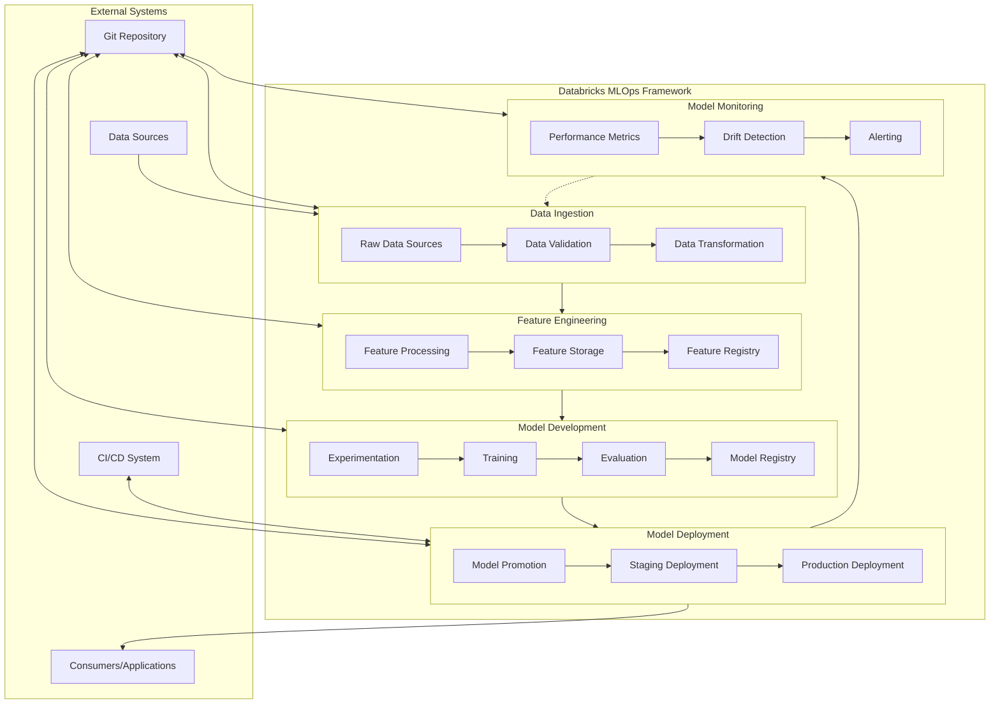
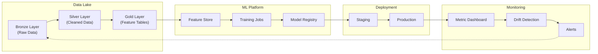
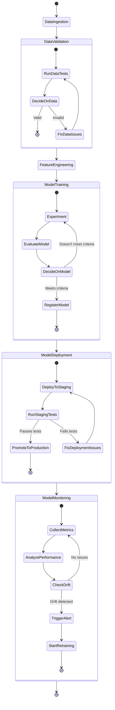

<div align="center">

```
       ████████╗██╗   ██╗██████╗ ███████╗███████╗ █████╗ ███████╗███████╗       
      ╚══██╔══╝╚██╗ ██╔╝██╔══██╗██╔════╝██╔════╝██╔══██╗██╔════╝██╔════╝       
         ██║    ╚████╔╝ ██████╔╝█████╗  ███████╗███████║█████╗  █████╗         
         ██║     ╚██╔╝  ██╔═══╝ ██╔══╝  ╚════██║██╔══██║██╔══╝  ██╔══╝         
         ██║      ██║   ██║     ███████╗███████║██║  ██║██║     ███████╗       
         ╚═╝      ╚═╝   ╚═╝     ╚══════╝╚══════╝╚═╝  ╚═╝╚═╝     ╚══════╝       
                                                                               
██████╗  █████╗ ████████╗ █████╗ ██████╗ ██████╗ ██╗ ██████╗██╗  ██╗███████╗   
██╔══██╗██╔══██╗╚══██╔══╝██╔══██╗██╔══██╗██╔══██╗██║██╔════╝██║ ██╔╝██╔════╝   
██║  ██║███████║   ██║   ███████║██████╔╝██████╔╝██║██║     █████╔╝ ███████╗   
██║  ██║██╔══██║   ██║   ██╔══██║██╔══██╗██╔══██╗██║██║     ██╔═██╗ ╚════██║   
██████╔╝██║  ██║   ██║   ██║  ██║██████╔╝██║  ██║██║╚██████╗██║  ██╗███████║   
╚═════╝ ╚═╝  ╚═╝   ╚═╝   ╚═╝  ╚═╝╚═════╝ ╚═╝  ╚═╝╚═╝ ╚═════╝╚═╝  ╚═╝╚══════╝   
                                                                               
    ███╗   ███╗██╗      ██████╗ ██████╗ ███████╗                               
    ████╗ ████║██║     ██╔═══██╗██╔══██╗██╔════╝                               
    ██╔████╔██║██║     ██║   ██║██████╔╝███████╗                               
    ██║╚██╔╝██║██║     ██║   ██║██╔═══╝ ╚════██║                               
    ██║ ╚═╝ ██║███████╗╚██████╔╝██║     ███████║                               
    ╚═╝     ╚═╝╚══════╝ ╚═════╝ ╚═╝     ╚══════╝                               
```

# Databricks MLOps Framework

### A strongly-typed, Pydantic-based MLOps framework for production ML on Databricks

[](https://github.com/gonnect-uk/databricks-mlops/blob/main/LICENSE)
[](https://github.com/gonnect-uk/databricks-mlops/stargazers)
[](https://pypi.org/project/databricks-mlops/)
[]()
[]()
[]()

</div>

## Overview

A comprehensive, type-safe MLOps framework for Databricks that follows best practices for the end-to-end machine learning lifecycle. Built on Pydantic models and strong Python typing, this framework provides a reliable foundation for production ML systems on the Databricks platform.

## Installation

```bash
# Install using uv (recommended)
uv pip install databricks-mlops

# Install specific components
uv pip install 'databricks-mlops[data,feature-engineering,model-training]'

# Install all components
uv pip install 'databricks-mlops[all]'
```

## MLOps Workflow

This framework provides an end-to-end MLOps workflow with strong type safety at every step:

1. **Data Ingestion & Validation** - Load data with type-safe validation rules
2. **Feature Engineering** - Transform features with proper typing
3. **Model Training** - Train models with MLflow integration
4. **Model Deployment** - Deploy to Databricks model registry
5. **Model Serving** - Access models through typed clients
6. **Model Monitoring** - Track drift and performance
7. **CI/CD Automation** - Automate with Databricks access bundles

Each component is built on Pydantic models for complete type safety and validation.

## 📚 Documentation

| Document | Description |
|----------|-------------|
| [**Usage Guide**](USAGE_GUIDE.md) | Step-by-step guide with practical examples |
| [**API Reference**](API_REFERENCE.md) | Comprehensive reference for all components |
| [**Architecture**](ARCHITECTURE.md) | Design principles and technical architecture |
| [**Deployment**](docs/DEPLOYMENT.md) | Model deployment and management |
| [**Model Serving**](docs/MODEL_SERVING.md) | Accessing deployed models securely |
| [**Automation**](docs/AUTOMATION.md) | CI/CD pipelines and workflows |
| [**Access Bundles**](docs/ACCESS_BUNDLES.md) | Secure authentication for automation |

## 🔍 Key Features

- **Complete Type Safety** - Pydantic models throughout the entire ML lifecycle
- **Configuration-Driven** - YAML-based configuration with schema validation
- **Databricks Integration** - Seamless connectivity with MLflow, Delta, and Unity Catalog
- **Expression Language** - Type-safe validation expressions (e.g., `email.str.contains('@') or email is null`)
- **Flexible Deployment** - Multi-environment model deployment with blue-green patterns
- **Secure Automation** - CI/CD integration with Databricks access bundles
- **Production Monitoring** - Drift detection and performance tracking
- **Model Registry Integration** - Version control and model governance

## Quick Start

```python
from databricks_mlops.pipelines import MLOpsWorkflow
from databricks_mlops.models.config import (
    DataConfig, FeatureConfig, TrainingConfig, DeploymentConfig
)
from databricks_mlops.utils.auth import WorkspaceConfig

# Create workspace configuration
workspace = WorkspaceConfig(
    host="https://your-workspace.cloud.databricks.com",
    token="${DATABRICKS_TOKEN}"  # Using environment variable
)

# Load typed configurations from YAML
data_config = DataConfig.from_yaml("configs/data_config.yaml")
feature_config = FeatureConfig.from_yaml("configs/feature_config.yaml")
training_config = TrainingConfig.from_yaml("configs/training_config.yaml")
deployment_config = DeploymentConfig.from_yaml("configs/deployment_config.yaml")

# Create end-to-end workflow with type safety
workflow = MLOpsWorkflow(
    workspace=workspace,
    data_config=data_config,
    feature_config=feature_config,
    training_config=training_config,
    deployment_config=deployment_config
)

# Execute the complete workflow
results = workflow.run()
print(f"Model deployed with ID: {results.model_id}, version: {results.version}")
```

## 📊 Data Ingestion & Validation

The framework provides a strongly-typed validation system that supports familiar syntax while maintaining complete type safety.

```python
from databricks_mlops.utils.data_validation import DataValidator
from databricks_mlops.models.validation import ValidationRule, Severity
import pandas as pd

# Create validation rules with proper typing
rules = [
    ValidationRule(
        name="valid_email",
        condition="email.str.contains('@') or email is null",
        severity=Severity.WARNING,
        description="Email should be in valid format or null"
    ),
    ValidationRule(
        name="adult_customers",
        condition="age >= 18 or guardian_email is not null",
        severity=Severity.ERROR,
        description="Customers under 18 need a guardian email"
    )
]

# Create validator with proper type checking
validator = DataValidator(rules=rules)

# Validate data with proper typing
results = validator.validate(customer_data)
print(f"Validation passed: {results.passed}")
print(f"Found {len(results.failures)} validation failures")
```

### Expression Language

The validation language supports operations with full type safety:

| Category | Operations | Example |
|----------|------------|--------|
| **Comparison** | `==`, `!=`, `>`, `>=`, `<`, `<=`, `is null`, `is not null` | `age >= 18` |
| **String** | `.str.contains()`, `.str.startswith()`, `.str.endswith()` | `email.str.contains('@')` |
| **Logical** | `and`, `or`, `not` | `(age >= 18) and (country == 'US')` |
| **Mathematical** | `+`, `-`, `*`, `/`, `%` | `total_price == quantity * unit_price` |
| **Collection** | `in`, `not in` | `status in ['active', 'pending']` |

All operations maintain type safety and provide meaningful error messages when operations are applied to incompatible types.

## 🧬 Feature Engineering

The framework provides strongly-typed components for feature engineering with full Pydantic validation.

```python
from databricks_mlops.feature_engineering import FeatureTransformer
from databricks_mlops.models.features import FeatureConfig, TransformationType
import pandas as pd

# Create type-safe feature configuration
config = FeatureConfig(
    name="customer_features",
    primary_keys=["customer_id"],
    timestamp_column="event_date",
    transforms={
        "tenure_months": TransformationType.NUMERIC_FILLNA,
        "has_phone_service": TransformationType.BOOLEAN_ENCODE,
        "monthly_charges_bin": {
            "type": TransformationType.BINNING,
            "source_column": "monthly_charges",
            "bins": [0, 50, 100, 150, float('inf')],
            "labels": ["low", "medium", "high", "premium"]
        }
    }
)

# Create transformer with proper type validation
transformer = FeatureTransformer(config=config)

# Transform features with type safety
transformed_features = transformer.fit_transform(customer_data)

# Save to Feature Store with proper typing
transformer.save_to_feature_store(
    feature_table_name="customer_features",
    database_name="ml_catalog"
)
```

The feature engineering module supports:
- Vectorized transformations with proper typing
- Integration with Databricks Feature Store
- Versioned feature groups with lineage tracking
- Automated feature documentation and metadata

## 🧠 Model Training

The framework provides type-safe model training with seamless MLflow integration.

```python
from databricks_mlops.model_training import ModelTrainer
from databricks_mlops.models.training import TrainingConfig, ModelType, MetricConfig
from sklearn.ensemble import RandomForestClassifier

# Define training configuration with proper typing
config = TrainingConfig(
    model_type=ModelType.CLASSIFICATION,
    model_name="customer_churn_predictor",
    target_column="churn",
    feature_columns=["tenure", "monthly_charges", "total_charges"],
    categorical_columns=["contract_type", "payment_method"],
    primary_metric="f1_score",
    additional_metrics=["accuracy", "precision", "recall"],
    hyperparameters={
        "n_estimators": 100,
        "max_depth": 10,
        "min_samples_split": 5
    }
)

# Create trainer with proper typing
trainer = ModelTrainer(config=config)

# Train model with MLflow tracking
model, metrics = trainer.train(
    train_data=train_df,
    validation_data=val_df,
    model_instance=RandomForestClassifier()
)

# Register model in MLflow with proper typing
model_uri = trainer.register_model(
    model=model,
    stage="Staging" 
)

print(f"Model registered at: {model_uri}")
print(f"Validation F1: {metrics['f1_score']:.4f}")
```

Model training includes:
- Automated MLflow experiment tracking
- Hyperparameter optimization
- Cross-validation with proper metrics
- Model serialization and versioning

## 🚀 Model Deployment

The framework enables type-safe model deployment to Databricks Model Registry and serving endpoints.

```python
from databricks_mlops.deployment import ModelDeployer
from databricks_mlops.models.deployment import DeploymentConfig, ServingConfig
from databricks_mlops.utils.auth import WorkspaceConfig

# Create workspace configuration
workspace = WorkspaceConfig(
    host="https://your-workspace.cloud.databricks.com",
    token="${DATABRICKS_TOKEN}"
)

# Create deployment configuration with proper typing
config = DeploymentConfig(
    model_name="customer_churn_predictor",
    model_uri="models:/customer_churn_predictor/Staging",
    description="Predicts customer churn probability",
    serving=ServingConfig(
        endpoint_name="churn-predictor-endpoint",
        instance_type="Standard_DS3_v2",
        scale_to_zero_enabled=True,
        min_instances=1,
        max_instances=4
    ),
    tags={
        "team": "customer_analytics",
        "use_case": "churn_prediction",
        "version": "1.0.0"
    }
)

# Create deployer with proper typing
deployer = ModelDeployer(workspace=workspace)

# Deploy model with type safety
endpoint = deployer.deploy_model(config=config)

print(f"Model deployed to endpoint: {endpoint.name}")
print(f"Endpoint URL: {endpoint.url}")
```

For detailed deployment options including blue-green deployments, multi-environment strategies, and deployment automation, see the [deployment documentation](docs/DEPLOYMENT.md).

## 🌐 Model Serving

The framework provides strongly-typed clients for interacting with deployed model endpoints.

```python
from databricks_mlops.model_serving import ModelClient
from databricks_mlops.models.serving import ClientConfig, AuthConfig, AuthType
import pandas as pd

# Create type-safe client configuration
client_config = ClientConfig(
    workspace_url="https://your-workspace.cloud.databricks.com",
    auth=AuthConfig(
        auth_type=AuthType.TOKEN,
        token="${DATABRICKS_TOKEN}"
    ),
    retry_config={
        "max_retries": 3,
        "backoff_factor": 0.5,
        "timeout_seconds": 30
    }
)

# Create client with proper typing
client = ModelClient(config=client_config)

# Prepare feature data with correct types
features = pd.DataFrame({
    "tenure": [12, 24, 36],
    "monthly_charges": [50.0, 70.0, 90.0],
    "contract_type": ["Month-to-month", "One year", "Two year"],
    "total_charges": [600.0, 1680.0, 3240.0]
})

# Get predictions with full type safety
response = client.predict(
    endpoint_name="churn-predictor-endpoint",
    features=features
)

# Process results with proper typing
probabilities = response.predictions["probability"]
churn_class = response.predictions["class"]
latency_ms = response.metadata.latency_ms

print(f"Predictions processed in {latency_ms}ms")
print(f"Churn probabilities: {probabilities}")
```

The serving module provides:
- Secure authentication with multiple methods
- Batching for high-throughput prediction
- Connection pooling for performance
- Comprehensive error handling
- Request/response logging and metrics

## 📈 Model Monitoring

The framework provides comprehensive model monitoring with drift detection and performance tracking.

```python
from databricks_mlops.monitoring import ModelMonitor
from databricks_mlops.models.monitoring import MonitoringConfig, DriftConfig, AlertConfig
from databricks_mlops.utils.auth import WorkspaceConfig

# Create workspace configuration
workspace = WorkspaceConfig(
    host="https://your-workspace.cloud.databricks.com",
    token="${DATABRICKS_TOKEN}"
)

# Create monitoring configuration with proper typing
config = MonitoringConfig(
    model_name="customer_churn_predictor",
    reference_dataset="dbfs:/reference/churn_baseline.delta",
    metrics=["accuracy", "f1_score", "precision", "recall"],
    feature_drift=DriftConfig(
        features=["tenure", "monthly_charges", "total_charges"],
        drift_methods=["wasserstein", "ks_test"],
        threshold=0.05
    ),
    alerts=AlertConfig(
        email_recipients=["data-science@example.com"],
        slack_webhook="https://hooks.slack.com/services/XXX/YYY/ZZZ",
        thresholds={
            "accuracy": 0.85,
            "drift_score": 0.10
        }
    ),
    schedule="0 */6 * * *"  # Every 6 hours
)

# Create monitor with proper typing
monitor = ModelMonitor(workspace=workspace)

# Set up monitoring with type safety
monitoring_job = monitor.setup_monitoring(config=config)

# Get current monitoring status
status = monitor.get_status(model_name="customer_churn_predictor")
print(f"Monitoring job: {monitoring_job.job_id}")
print(f"Last run status: {status.last_run_status}")
print(f"Current drift score: {status.metrics.drift_score:.4f}")
```

The monitoring module includes:
- Data and prediction drift detection
- Performance metrics tracking
- Automated alerting on thresholds
- Scheduled monitoring jobs
- Detailed monitoring dashboards

## Project Structure

A typical MLOps project using this framework looks like:

```
project/
├── configs/                   # Configuration files
│   ├── data_config.yaml       # Data validation rules
│   ├── feature_config.yaml    # Feature transformations
│   ├── training_config.yaml   # Model training settings
│   ├── deployment_config.yaml # Deployment parameters
│   └── monitoring_config.yaml # Monitoring settings
├── pipeline/                  # Pipeline components
│   ├── ingest.py              # Data ingestion script
│   ├── features.py            # Feature engineering 
│   ├── train.py               # Model training
│   ├── deploy.py              # Model deployment 
│   └── monitor.py             # Model monitoring
├── notebooks/                 # Databricks notebooks
│   └── development.ipynb      # Development notebook
├── tests/                     # Tests for all components
│   ├── test_data.py           # Data validation tests
│   ├── test_features.py       # Feature tests
│   ├── test_training.py       # Training tests
│   └── test_e2e.py            # End-to-end tests
├── README.md                  # Project documentation
└── pyproject.toml            # Dependencies and build
```

## Type Safety Philosophy

This framework follows these principles for maximum reliability:

- **Pydantic Everywhere**: All configurations and models use Pydantic
- **No String Parsing**: All expressions parsed into typed structures
- **Runtime Type Validation**: Operations validate types at execution time
- **Explicit Error Handling**: Specific exceptions with clear messages
- **Documentation in Types**: Type hints document the code

These principles ensure your ML pipelines are reliable and maintainable.

## Learn More

For more details on using the framework, visit the following documentation:

- [Usage Guide](USAGE_GUIDE.md) - Step-by-step tutorial
- [API Reference](API_REFERENCE.md) - Detailed class and method documentation
- [Deployment Guide](docs/DEPLOYMENT.md) - Model deployment strategies
- [Model Serving](docs/MODEL_SERVING.md) - Serving model endpoints
- [Monitoring](docs/MONITORING.md) - Drift detection and performance tracking
- [CI/CD Automation](docs/AUTOMATION.md) - Continuous integration and deployment

## License

This project is licensed under the MIT License - see the [LICENSE](LICENSE) file for details.

## 💾 Examples

The `examples/` directory contains practical implementations showcasing the framework:

| Example | Description |
|---------|-------------|
| [**Complete MLOps Pipeline**](examples/complete_mlops_pipeline.py) | End-to-end MLOps pipeline orchestration |
| [**Customer Churn Prediction**](examples/customer_churn_prediction.py) | Practical implementation of churn prediction model |
| [**Model Monitoring**](examples/model_monitoring_example.py) | Drift detection and monitoring implementation |
| [**Model Serving**](examples/model_serving_example.py) | Type-safe Databricks model serving endpoint integration |
| [**Integrated Serving**](examples/integrated_serving_example.py) | Complete workflow from training to serving with type safety |
| [**Expression Validation**](examples/expression_validation_example.py) | Type-safe validation expressions with Pandas-style syntax |
| [**Integration Tests**](examples/integration_test.py) | Tests demonstrating component interactions |


## 📋 YAML Configuration Reference

The framework uses strongly-typed YAML configuration files for all components, ensuring type safety while maintaining readability. Each configuration is automatically validated against Pydantic models at runtime.

### Data Pipeline Configuration

| Field | Type | Description | Default | Required |
|-------|------|-------------|---------|----------|
| `source_path` | `str` | Path to source data (Delta table or file) | - | ✅ |
| `destination_path` | `str` | Path where processed data will be saved | - | ✅ |
| `validation_rules` | `List[ValidationRule]` | Data quality validation rules | `[]` | ❌ |
| `format` | `str` | Data format (delta, parquet, csv) | `"delta"` | ❌ |
| `transformation_steps` | `List[TransformStep]` | Data transformation operations | `[]` | ❌ |
| `partitioning_columns` | `List[str]` | Columns to partition by | `[]` | ❌ |
| `z_order_by` | `List[str]` | Columns to optimize using Z-ordering | `[]` | ❌ |
| `environment_vars` | `Dict[str, str]` | Environment variables for substitution | `{}` | ❌ |

**Example:**

```yaml
source_path: "dbfs:/mnt/data/raw/customer_data"
destination_path: "dbfs:/mnt/data/processed/customer_data"
format: "delta"
partitioning_columns: ["region", "date"]
validation_rules:
  - name: "no_missing_ids"
    condition: "customer_id is not null"
    severity: "error"
    description: "Customer ID should never be null"
  - name: "valid_email"
    condition: "email.str.contains('@') or email is null"
    severity: "warning"
    description: "Email should have valid format if present"
transformation_steps:
  - type: "drop_columns"
    columns: ["temp_id", "_metadata"]
  - type: "rename_columns"
    mapping: {"customer_identifier": "customer_id"}
z_order_by: ["customer_id", "transaction_date"]
environment_vars:
  DATA_ENV: "${DATA_ENV:-production}"
  REGION: "${REGION:-us-west}"
```

### Feature Engineering Configuration

| Field | Type | Description | Default | Required |
|-------|------|-------------|---------|----------|
| `source_table` | `str` | Source table for feature creation | - | ✅ |
| `feature_table_name` | `str` | Name for the output feature table | - | ✅ |
| `primary_keys` | `List[str]` | Primary key column(s) | - | ✅ |
| `features` | `List[str]` | List of features to include | `[]` | ✅ |
| `timestamp_column` | `str` | Column for temporal tracking | - | ✅ |
| `partition_columns` | `List[str]` | Columns to partition feature table by | `[]` | ❌ |
| `description` | `str` | Feature table description | `""` | ❌ |
| `tags` | `Dict[str, str]` | Metadata tags | `{}` | ❌ |
| `online_store_enabled` | `bool` | Enable online feature store | `False` | ❌ |
| `offline_store_path` | `str` | Path for offline feature store | - | ❌ |
| `feature_transformations` | `Dict[str, TransformSpec]` | Feature-specific transformations | `{}` | ❌ |

**Example:**

```yaml
source_table: "main.analytics.customer_data_processed"
feature_table_name: "customer_churn_features"
primary_keys: 
  - "customer_id"
features:
  - "tenure"
  - "monthly_charges"
  - "total_charges"
  - "contract_type"
  - "payment_method"
timestamp_column: "last_update_time"
partition_columns:
  - "subscription_type"
description: "Feature table for customer churn prediction"
tags:
  owner: "data_science_team"
  version: "1.0.0"
online_store_enabled: true
offline_store_path: "dbfs:/mnt/gold/feature_store/customer_churn_features"
feature_transformations:
  contract_type:
    type: "one_hot_encode"
    output_columns: ["contract_monthly", "contract_yearly", "contract_quarterly"]
  monthly_charges:
    type: "scaling"
    method: "min_max"
```

### Model Training Configuration

| Field | Type | Description | Default | Required |
|-------|------|-------------|---------|----------|
| `model_type` | `str` | Type of model (classification, regression, etc.) | - | ✅ |
| `target_column` | `str` | Target variable for prediction | - | ✅ |
| `feature_columns` | `List[str]` | Features to use for training | - | ✅ |
| `hyperparameters` | `Dict[str, Any]` | Model hyperparameters | `{}` | ❌ |
| `split_ratios` | `List[float]` | Train/validation/test split ratios | `[0.7, 0.15, 0.15]` | ❌ |
| `metrics` | `List[str]` | Metrics to track during training | `[]` | ❌ |
| `experiment_name` | `str` | MLflow experiment name | - | ✅ |
| `run_name` | `str` | MLflow run name | `""` | ❌ |
| `registry_model_name` | `str` | Name for registering in MLflow Model Registry | - | ✅ |
| `cross_validation_folds` | `int` | Number of cross-validation folds | `0` | ❌ |
| `stratify` | `bool` | Whether to stratify the training split | `False` | ❌ |
| `sample_weight_column` | `str` | Column to use for weighted training | `""` | ❌ |

**Example:**

```yaml
model_type: "classification"
target_column: "churn"
feature_columns:
  - "tenure"
  - "monthly_charges"
  - "contract_monthly"
  - "contract_yearly"
  - "tech_support"
hyperparameters:
  n_estimators: 100
  max_depth: 5
  min_samples_split: 10
  class_weight: "balanced"
  random_state: 42
split_ratios: [0.7, 0.15, 0.15]
metrics:
  - "accuracy"
  - "precision"
  - "recall"
  - "f1_score"
  - "roc_auc"
experiment_name: "customer_churn_prediction"
run_name: "xgboost_tuned_v2"
registry_model_name: "customer_churn_predictor"
cross_validation_folds: 5
stratify: true
sample_weight_column: "importance_weight"
```

### Model Deployment Configuration

| Field | Type | Description | Default | Required |
|-------|------|-------------|---------|----------|
| `model_name` | `str` | Name of the registered model | - | ✅ |
| `model_version` | `str` | Version to deploy (or "latest") | - | ✅ |
| `environment` | `str` | Deployment environment (dev, staging, prod) | - | ✅ |
| `deployment_type` | `str` | Type of deployment (serving_endpoint, batch, etc.) | - | ✅ |
| `endpoint_name` | `str` | Name for serving endpoint | - | ❌ |
| `compute_type` | `str` | Compute type (cpu, gpu) | `"cpu"` | ❌ |
| `compute_scale` | `int` | Compute size/scale | `1` | ❌ |
| `min_replicas` | `int` | Minimum number of replicas | `1` | ❌ |
| `max_replicas` | `int` | Maximum number of replicas | `1` | ❌ |
| `autoscaling_enabled` | `bool` | Enable auto-scaling | `False` | ❌ |
| `enable_access_control` | `bool` | Enable endpoint access control | `True` | ❌ |
| `timeout_seconds` | `int` | Timeout for endpoint requests | `300` | ❌ |
| `tags` | `Dict[str, str]` | Metadata tags | `{}` | ❌ |
| `environment_variables` | `Dict[str, str]` | Environment variables for endpoint | `{}` | ❌ |

**Example:**

```yaml
model_name: "customer_churn_predictor"
model_version: "1"
environment: "staging"
deployment_type: "serving_endpoint"
endpoint_name: "customer-churn-predictor"
compute_type: "cpu"
compute_scale: 2
min_replicas: 1
max_replicas: 5
autoscaling_enabled: true
enable_access_control: true
timeout_seconds: 300
tags:
  purpose: "churn_prediction"
  team: "customer_analytics"
  version: "1.0.0"
environment_variables:
  LOG_LEVEL: "INFO"
  ENABLE_MONITORING: "true"
  RATE_LIMITING: "100"
```

### Monitoring Configuration

| Field | Type | Description | Default | Required |
|-------|------|-------------|---------|----------|
| `enabled` | `bool` | Enable monitoring | `True` | ❌ |
| `metrics` | `List[str]` | Metrics to monitor | - | ✅ |
| `alert_thresholds` | `Dict[str, float]` | Alerting thresholds for metrics | `{}` | ❌ |
| `monitoring_interval_minutes` | `int` | Monitoring frequency in minutes | `60` | ❌ |
| `data_drift_detection` | `DataDriftConfig` | Data drift detection settings | - | ❌ |
| `model_performance_tracking` | `ModelPerfConfig` | Performance tracking settings | - | ❌ |
| `alerting` | `AlertConfig` | Alerting configuration | - | ❌ |
| `dashboard_name` | `str` | Monitoring dashboard name | `""` | ❌ |

**Example:**

```yaml
enabled: true
metrics:
  - "prediction_drift"
  - "feature_drift"
  - "model_accuracy"
  - "data_quality"
alert_thresholds:
  prediction_drift: 0.1
  feature_drift: 0.05
  model_accuracy: 0.8
monitoring_interval_minutes: 30
data_drift_detection:
  method: "ks_test"
  reference_dataset: "dbfs:/reference_data/baseline.delta"
  features_to_monitor:
    - "tenure"
    - "monthly_charges"
  threshold: 0.05
model_performance_tracking:
  metrics_table: "monitoring.model_metrics"
  baseline_run_id: "abcdef1234567890"
alerting:
  notification_channels:
    - type: "email"
      recipients: ["team@example.com"]
    - type: "slack"
      webhook: "${SLACK_WEBHOOK_URL}"
  include_details: true
  aggregation_window: "1h"
dashboard_name: "churn_model_monitoring"
```

### Pipeline Orchestration Configuration

| Field | Type | Description | Default | Required |
|-------|------|-------------|---------|----------|
| `name` | `str` | Pipeline name | - | ✅ |
| `description` | `str` | Pipeline description | `""` | ❌ |
| `owner` | `str` | Owner email/username | - | ✅ |
| `tags` | `Dict[str, str]` | Pipeline tags | `{}` | ❌ |
| `timeout_minutes` | `int` | Pipeline timeout | `60` | ❌ |
| `retry_attempts` | `int` | Number of retry attempts | `0` | ❌ |
| `environment` | `str` | Execution environment | - | ✅ |
| `schedule` | `ScheduleConfig` | Scheduling configuration | - | ❌ |
| `dependencies` | `List[str]` | Pipeline dependencies | `[]` | ❌ |
| `notification` | `NotificationConfig` | Notification settings | - | ❌ |

**Example:**

```yaml
name: customer_churn_feature_pipeline
description: "Feature engineering pipeline for customer churn prediction model"
owner: "data_scientist@example.com"
tags:
  domain: customer_analytics
  project: churn_prediction
  environment: development
timeout_minutes: 45
retry_attempts: 2
environment: development
schedule:
  cron: "0 3 * * *"  # Daily at 3 AM
  timezone: "UTC"
  pause_status: "UNPAUSED"
dependencies:
  - "customer_data_processing_pipeline"
notification:
  on_start: false
  on_success: true
  on_failure: true
  recipients:
    - "data_team@example.com"
```

## Architecture



## Component Structure


## Data Flow



## Workflow Orchestration



## Getting Started

### Installation

```bash
# Using uv (recommended)
uv venv -p python3.9 .venv
source .venv/bin/activate
uv pip install -e .

# Or using pip
pip install -e .
```

### Basic Usage

Here's a simple example to get started:

```python
from databricks_mlops.core.pipeline import DataPipeline
from databricks_mlops.models.config import DataConfig
from databricks_mlops.utils.logging import setup_logger

# Setup logger
logger = setup_logger("data-pipeline")

# Create configuration
config = DataConfig(
    source_path="dbfs:/path/to/source",
    destination_path="dbfs:/path/to/destination",
    table_name="my_dataset",
    validation_rules=[
        "column_count > 5",
        "customers.id is not null"
    ]
)

# Initialize and run pipeline
pipeline = DataPipeline(config)
result = pipeline.run()

logger.info(f"Pipeline completed with status: {result.status}")
```

## Development

### Running Tests

```bash
pytest
```

### Code Quality Checks

```bash
# Run all quality checks
pre-commit run --all-files

# Or individual checks
black databricks_mlops tests
isort databricks_mlops tests
mypy databricks_mlops
ruff check databricks_mlops tests
```

## License

MIT
