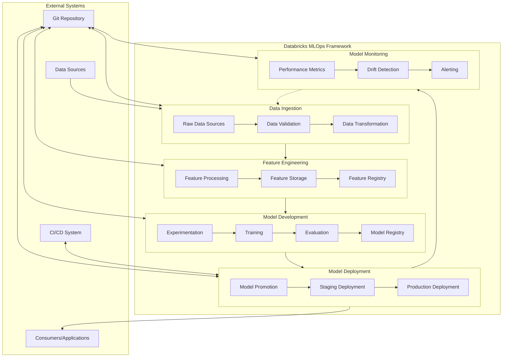
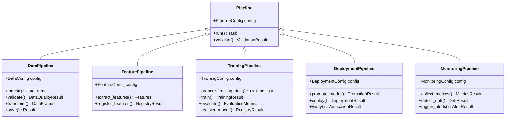
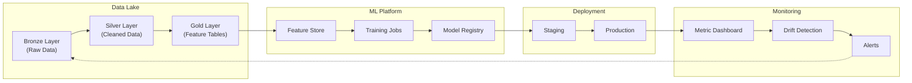
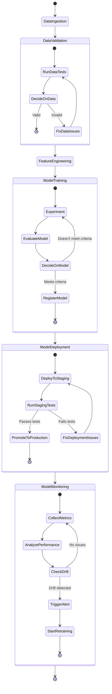

# Databricks MLOps Framework

A comprehensive, type-safe MLOps framework for Databricks that follows best practices for the end-to-end machine learning lifecycle. The framework emphasizes type safety, modularity, and automated MLOps processes.

## Overview

This framework provides a standardized approach to machine learning operations on Databricks, incorporating:

- Strong typing with Pydantic models
- End-to-end ML pipeline automation
- Built-in monitoring and data quality checks
- Comprehensive CI/CD integration
- Multi-environment deployment orchestration
- Artifact management and versioning

## Architecture



## Component Structure



## Data Flow



## Workflow Orchestration



## Getting Started

### Installation

```bash
# Using uv (recommended)
uv venv -p python3.9 .venv
source .venv/bin/activate
uv pip install -e .

# Or using pip
pip install -e .
```

### Basic Usage

Here's a simple example to get started:

```python
from databricks_mlops.core.pipeline import DataPipeline
from databricks_mlops.models.config import DataConfig
from databricks_mlops.utils.logging import setup_logger

# Setup logger
logger = setup_logger("data-pipeline")

# Create configuration
config = DataConfig(
    source_path="dbfs:/path/to/source",
    destination_path="dbfs:/path/to/destination",
    table_name="my_dataset",
    validation_rules=[
        "column_count > 5",
        "customers.id is not null"
    ]
)

# Initialize and run pipeline
pipeline = DataPipeline(config)
result = pipeline.run()

logger.info(f"Pipeline completed with status: {result.status}")
```

## Development

### Running Tests

```bash
pytest
```

### Code Quality Checks

```bash
# Run all quality checks
pre-commit run --all-files

# Or individual checks
black databricks_mlops tests
isort databricks_mlops tests
mypy databricks_mlops
ruff check databricks_mlops tests
```

## License

MIT
